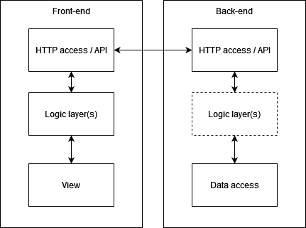

# Design

## Introduction

This aims to go into some abstract design about exactly what needs to be built, but without defining exact implementations. This way, we don't limit ourselves in terms of end-solution.
Specifically, there should be no detail about:

- Language(s) for development
- Tooling
- Code styling

And instead, this will aim to describe in some detail:

- Infrastructure
- Architecture

###  Referencing Planning

Some of the content below will reference the planning document, where some requirements were presented. Requirements will be referenced using a prefix (e.g. M for must, S for should, etc.) and then the number in which they're ordered. As an example, requirement M1 would refer to "_It **must** be possible to create and schedule events_."

## Infrastructure

A lot of requirements, especially S4, point towards a web-based system being most suitable. This way, requirements such as M5 become much easier to meet (given the accessibility and availability of websites). Requirements such as M2 also narrow down the infrastructure and architecture we'd want, as it's not possible to simply have a static front-end if we need some level of authorisation.

As a result, the proposed infrastructure is described in the diagram below:

This infrastructure is very common in web deployment to allow splitting the static front end (which can be manipulated by end-users) and the back-end (which can handle sanitisation, authorisation, and so on) with some data.

## Architecture

The above infrastructure already largely suggests some architecture; the front-end and back-end will need to be separated, and it's common for these separate pieces to have n-tier architecture to separate concerns. As an example, maintenance becomes much easier when separating layers such as data access and logic, or the HTTP and display layers.

Below is a suggestion for n-tier architectures, showing both the front-end and back-end along with where they'd communicate.

This proposal is purely based on common industry practices, which help with code cleanliness, readability and maintenance. As behaviour and exact implementation is narrowed down, these layers (if necessary) will become much clearer and built out.